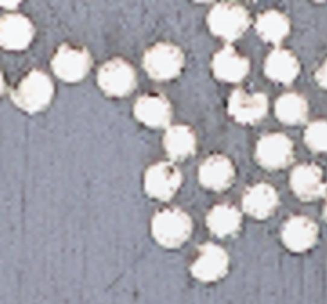

# FibreLytics a Composite Fiber Analysis Tool

FibreLytics is a desktop computer vision app that analyzes cross-section images of fiber-reinforced composite tapes.  
It detects fibers, identifies centers and radii (ray-casting), segments contours (watershed), and computes **Fiber Volume Fraction (Vf)**.  

---

## Purpose of the Project

The purpose of FibreLytics is to provide an accessible tool for analyzing **fiber distribution and fiber volume fraction** in composite tape materials.  
It aims to assist engineers and researchers in **quality inspection, material characterization, and process validation** by automating tasks that are usually time-consuming when performed manually.  

By offering a clear visualization pipeline and per-fiber data export, this tool helps non-technical users and specialists alike to **better understand the microstructure of composites**, supporting decision-making in material design and manufacturing.

---

## Screenshot

> **Screenshot source:** sample tape image is from:  
> N. Katuin, D. M. J. Peeters, and C. A. Dransfeld, *“Method for the Microstructural Characterisation of Unidirectional Composite Tapes,”* **Journal of Composites Science**, 5(10):275, 2021. DOI: 10.3390/jcs5100275.

---

## Project Report PDF

- **Project Report PDF:** [`docs/Fibrelytics.pdf`](docs/Fibrelytics.pdf)

---

## Features

- Load microscopy/tape images
- Parameterized pipeline (mean-shift, blur, CLAHE, Otsu, distance map, local maxima, watershed)
- Optional **polygon mask** to restrict analysis to the tape region
- Visual step-by-step previews
- Export per-fiber measurements to CSV (center, avg radius, circular area, contour area)
- Progress bar + status messages

---

## Project Structure

FibreLytics/
├─ app.py # Tkinter GUI 
├─ backend.py # computer vision/analysis pipeline 
├─ assets/
│ └─ sample_tape.png # assets/sample_tape.png
├─ docs/
│ └─ Fibrelytics.pdf # docs/Fibrelytics.pdf
├─ README.md
└─ requirements.txt

---

How It Works (Pipeline Summary)

- **Mean Shift** — denoise while preserving edges  
- **Gaussian Blur** — soften residual noise  
- **Grayscale + CLAHE** — improve local contrast  
- **Otsu Thresholding** — binary segmentation  
- **Distance Transform** — bright centers ≈ fiber cores  
- **Local Maxima** — seed detection  
- **Connected Components** — seed labeling  
- **Watershed** — split touching fibers  
- **Contours & Centers** — contour extraction + centroids  
- **Proximity Filter** — remove near-duplicates by min distance  
- **Ray-Casting Radius** — cast rays to contour hits, average distances → radius  
- **Fiber Volume Fraction (Vf)** — sum(contour areas) / (image or mask area)  

---

## Development Note

This project was developed under **time constraints in just 2 weeks**:  
- **Week 1:** Reading the research paper, trying to understand the problem, and contacting the requestor (a non-technical stakeholder) to clarify requirements.  
- **Week 2:** Implementing the GUI and backend pipeline into a working prototype, and writing the report.  

 **Please note:** this project was developed using **only one image** due to privacy and confidentiality reasons. Because of this, further testing and improvements are required before it can be considered production-ready.  